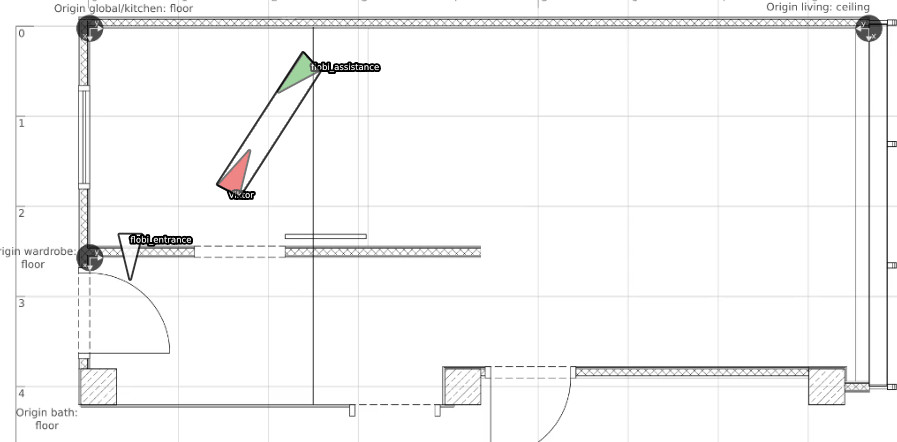

# Annotation Tool M/G/R

A set of lua scripts to allow annotation of movements, groups, and roles in videos with the lua api of the mpv player.



## Set-Up

Clone the project recursively with all dependencies:

```> git clone --recursive https://github.com/vrichter/annotation-mgr.git```

Change into the directory:

```> cd annotation-mgr```

Set-up dependencies with make:

```> make```

Run the application:

*ATTENTION: the application will expect config files and create annotation data next to the opened videos*

```./annotator <path-to-video-file>```

## Dependencies

The following lua dependencies are forked and copied into the `dependencies` folder:

* json.lua from [rxi](https://github.com/rxi/json.lua) - license: [MIT](https://opensource.org/licenses/MIT)
* matrix.lua from [Michael Lutz, David Manura](https://github.com/davidm/lua-matrix) - license: [LUA](https://www.lua.org/license.html)
* uuid.lua from [Rackspace/Thijs Schreijer](https://github.com/Tieske/uuid) - license: [Apache2.0](http://www.apache.org/licenses/LICENSE-2.0)

The following dependencies are imported as submodules:

* mpvcontextmenu from [Thomas Carmichael](https://gitlab.com/carmanaught/mpvcontextmenu.git) - license: [MIT](https://opensource.org/licenses/MIT)
* hungarian from [Sam Hocevar](https://github.com/RoboJackets/hungarian.git) - license: 'Do what you want'
* luwra from [Ole Krüger](https://github.com/vapourismo/luwra.git) - license: BSD
* fformation from [Viktor Richter](https://github.com/vrichter/fformation.git) - license: LGPL
* fformation-gco from [Viktor Richter](https://github.com/vrichter/fformation-gco.git) - license: [Research Only with Citation](https://github.com/vrichter/gco-v3.0)